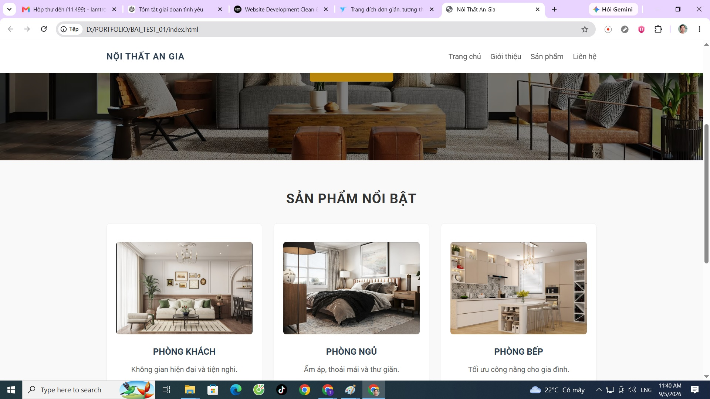

# Nội Thất An Gia - Thiết kế nội thất hiện đại

Website giới thiệu dịch vụ thiết kế và thi công nội thất An Gia.

Dự án được xây dựng bằng HTML và CSS, tập trung vào giao diện hiện đại, bố cục rõ ràng và trình bày các sản phẩm nội thất trực quan.

## Demo trực tuyến

https://lamtrong.github.io/noithat-angia-portfolio/

## Ảnh giao diện

## Tính năng giao diện

- Thanh điều hướng
- Khu vực giới thiệu nổi bật
- Danh sách sản phẩm nội thất
- Hình ảnh phòng khách, phòng ngủ và phòng bếp
- Bố cục website rõ ràng, dễ sử dụng
- Giao diện responsive cho nhiều kích thước màn hình

## Công nghệ sử dụng

- HTML5
- CSS3
- Flexbox
- Responsive Web Design

## Mục đích dự án

Dự án được thực hiện nhằm luyện tập kỹ năng xây dựng giao diện website bằng HTML và CSS, tổ chức bố cục và tối ưu hiển thị trên nhiều thiết bị.
